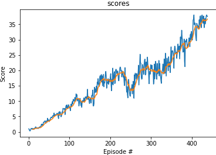

# Project 2: Continous Control

## Introduction
The second environment is used for training and demonstration.

## Learning algorithms
### Deep Deterministic Policy gradient (DDPG)
I used the DDPG from ddpg-pendulum.
The core idea of DDPG is : 
- An Actor network to approximate the optimal policy.
- A Critic network to approximate the state-action value function.

### hyper-parameters
Theses hyper-parameters are used for DDPG.

| hyper-parameters        | Value           | 
| ------------- | -------------| 
| BUFFER_SIZE      | 10000 | 
| BATCH_SIZE      | 128 | 
| discount factor      | 0.99      |   
| TAU for soft update of target parameters| 1e-3    |   
| learning rate actor | 1e-4    |   
| learning rate critic | 1e-3    |   
| WEIGHT_DECAY | 0    |  
| BETA | 0.999    |  

### Neural work architecture
The neutral network has the same architecture as it of DQN except the last layer. 
Actor network architecture is:
- Input layer size: 33
- Hidden layer 1 size: 128
- Hidden layer 2 size: 64
- Output layer size: 4

Critic network architecture is:
- Input layer size: 33
- Hidden layer 1 size: 128
- Hidden layer 2 size: 64
- Output layer size: 1

### Implementation tricks
1. Start from small network.
2. Amended the code to update the networks 10 times after every 20 time steps. 
3. Use a beta to slowly reduce noises. This led to quicker convergence at the final stage.
4. At first, I followed the instruction from a post of a mentor: "_You should reset the environment only at the beginning of your training._" 
Unfortunately, this made the average score always less than 1.0. Now I reset the environment after every episode.

## Experiment results
DDPG solved the environment in **339** episodes with average Score: 30.02.

## Ideas for Future Work
At the beggining of trainning, it is really difficult for the agent get some rewards. Prioritized experience replay might be helpful.

It will be interesting and challenging to try A3C or A2C in the environment.

## References
### Paper
- [DDPG](https://arxiv.org/abs/1509.02971)

